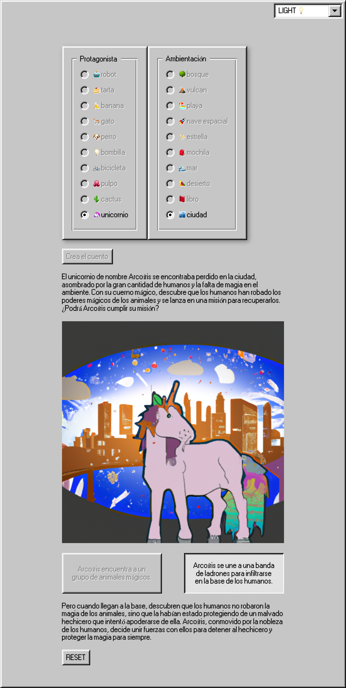

# Adventure Story Generator

This app generates a random adventure story based on user inputs of protagonist and location. It uses OpenAI API to generate text and DALL-E 2 API to generate a retro art image that goes along with the story.

The user is able to choose two different paths that the story can take, leading to a unique and unpredictable adventure every time. The generated story is displayed in a retro-style interface using the react95 library, giving it a classic 90s aesthetic.

## Warning

There is currently a random bug in the application and I'm moving to Next.js Edge Functions to resolve the issue. Stay tuned for updates!
